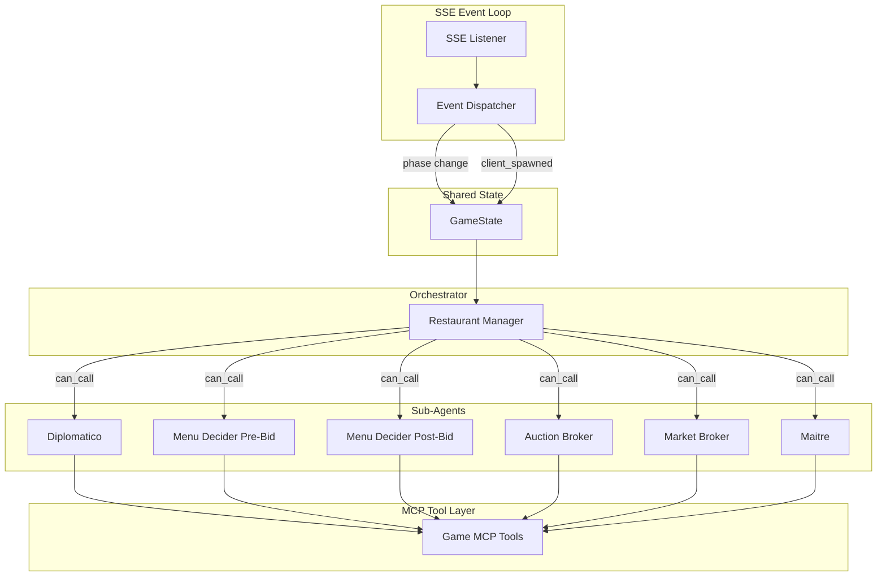
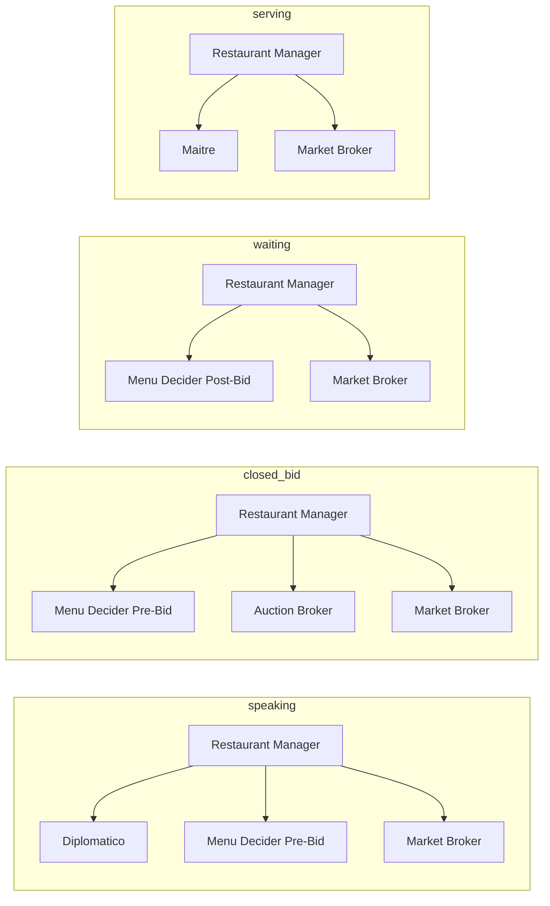

# Hackapizza 2.0 Multi-Agent Restaurant System - Implementation Plan

## Architecture Overview




## Phase-to-Agent Dispatch Flow




---

## 1. Project Structure

Create the following layout (aligned with [prompt.md](prompt.md)):

```
src/
  config.py              # TEAM_ID, API_KEY, BASE_URL, REGOLO_API_KEY
  main.py                 # Entry point, async event loop
  state/
    game_state.py         # GameState dataclass, state update logic
  sse/
    listener.py           # SSE connection, parse events, dispatch
  tools/
    mcp_client.py         # HTTP client for POST /mcp (JSON-RPC)
    game_tools.py         # @tool wrappers for all 10 MCP tools
  agents/
    restaurant_manager.py # Orchestrator agent definition
    diplomatico.py
    menu_decider_pre_bid.py
    menu_decider_post_bid.py
    auction_broker.py
    market_broker.py
    maitre.py
  prompts/
    restaurant_manager.py
    diplomatico.py
    menu_decider_pre_bid.py
    menu_decider_post_bid.py
    auction_broker.py
    market_broker.py
    maitre.py
```

Reuse and extend [client_template.py](client_template.py) for SSE handling; refactor phase handlers to invoke the orchestrator instead of placeholder logs.

---

## 2. MCP Tool Layer

**Problem**: The game server exposes tools via `POST /mcp` with JSON-RPC `tools/call`. Datapizza's `MCPClient` expects standard MCP; the Hackapizza server may use a custom transport.

**Approach**: Implement Python `@tool` wrappers that call the game server via `aiohttp` or `httpx`. Each tool maps to one MCP tool (e.g. `closed_bid`, `save_menu`, `prepare_dish`, `serve_dish`, `create_market_entry`, `execute_transaction`, `delete_market_entry`, `update_restaurant_is_open`, `send_message`). Add `restaurant_info` and `get_meals` as HTTP GET wrappers if they are MCP tools, or keep them as direct HTTP calls used by state/agents.

Reference: [utils.md](utils.md) for exact curl payloads; [knowledge/hackapizza_flow.html](knowledge/hackapizza_flow.html) lines 658-711 for tool schemas.

**Phase gating**: Pass `current_phase` into the tool layer and raise a clear error if a tool is called in a disallowed phase (e.g. `closed_bid` in speaking). This prevents invalid calls and rate-limit waste.

---

## 3. State Management

**GameState** (in `state/game_state.py`):

- `phase`: str (`speaking` | `closed_bid` | `waiting` | `serving` | `stopped`)
- `turn_id`: int (from `game_started`)
- `restaurant_id`: int (TEAM_ID)
- `balance`, `inventory`, `menu`, `reputation`: from `GET /restaurant/:id`
- `recipes`: from `GET /recipes` (cache at startup)
- `restaurants`: from `GET /restaurants` (for Diplomatico broadcast)
- `meals`: from `GET /meals?turn_id=&restaurant_id=` (for Maitre client_id mapping)
- `market_entries`: from `GET /market/entries`
- `pending_clients`: list of `{client_id, clientName, orderText}` from `client_spawned` + meals
- `prepared_dishes`: queue of dishes ready to serve (from `preparation_complete`)

**Update triggers**:

- `game_started` → set `turn_id`, refresh restaurant/recipes if needed
- `game_phase_changed` → set `phase`, optionally refresh state before delegating
- `client_spawned` → add to `pending_clients`; fetch `/meals` to resolve `client_id`
- `preparation_complete` → add dish to `prepared_dishes`
- Before each phase handler → refresh restaurant, meals, market as needed

---

## 4. SSE Integration

Refactor [client_template.py](client_template.py):

1. Extract `handle_line`, `dispatch_event` into `sse/listener.py`.
2. Replace placeholder phase handlers with calls to an `OrchestratorRunner` that:
  - Updates `GameState`
  - Calls `restaurant_manager_agent.run(f"Current phase: {phase}. Context: {state_summary}. Execute phase-specific tasks.")`
3. For `client_spawned`: update state, then trigger Maitre (or Restaurant Manager which delegates to Maitre) with the new client info.
4. For `preparation_complete`: update state, trigger Maitre to call `serve_dish` with the correct `client_id`.

**Critical**: The Restaurant Manager runs asynchronously. Use `asyncio.create_task` or a queue so SSE handling does not block, and agents can complete their tool calls. Consider a simple queue: events → queue → process one at a time to avoid overlapping agent runs.

---

## 5. Agent Definitions

**Client**: Use `OpenAILikeClient` from `datapizza.clients.openai_like` with Regolo.ai (see [hackapizza_flow.html](knowledge/hackapizza_flow.html) lines 1180-1186).

**Restaurant Manager**:

- `stateless=False` for memory
- `can_call([diplomatico, menu_decider_pre_bid, menu_decider_post_bid, auction_broker, market_broker, maitre])`
- No tools; only delegates
- System prompt: phase-based routing rules, when to call which agent, context to pass

**Sub-agents**:

- Each has a dedicated system prompt (in `prompts/`) and receives tools relevant to its role.
- **Tool assignment**:
  - Diplomatico: `send_message`, `get_restaurants` (or access to restaurant list via context)
  - Menu Decider Pre-Bid: `save_menu`, read-only context (recipes, balance, inventory)
  - Menu Decider Post-Bid: `save_menu`, context with post-auction inventory
  - Auction Broker: `closed_bid`, context (menu, recipes, balance)
  - Market Broker: `create_market_entry`, `execute_transaction`, `delete_market_entry`, context (inventory, market_entries)
  - Maitre: `prepare_dish`, `serve_dish`, context (menu, pending_clients, prepared_dishes, intolerances from meals)

**Diplomatico "broadcast"**: `send_message` requires `recipient_id`. Implement as: fetch `GET /restaurants`, filter out own `restaurant_id`, then call `send_message` for each other restaurant with the collaboration request. This is the only way to approximate "message to all."

---

## 6. System Prompts (Skeleton)

Each prompt file defines `SYSTEM_PROMPT` as a string. Keep them minimal for the first version:

- **restaurant_manager**: "You are the Restaurant Manager. Based on the current phase (speaking|closed_bid|waiting|serving), delegate to the appropriate sub-agents. Phase X: call agents A, B, C. Pass the provided context. Do not perform actions yourself."
- **diplomatico**: "Send a message to all other restaurants asking for potential collaboration. Use send_message for each recipient. You have the list of restaurant IDs."
- **menu_decider_pre_bid**: "Given balance, recipes, and inventory, propose a draft menu (recipes + prices). Output the menu structure; the orchestrator will call save_menu."
- **menu_decider_post_bid**: "Given the actual inventory after the auction, finalize the menu. Call save_menu with the final items."
- **auction_broker**: "Given the menu and strategy, compute bids for ingredients and call closed_bid."
- **market_broker**: "Monitor market entries. Buy missing ingredients or sell surplus. Use create_market_entry, execute_transaction, delete_market_entry."
- **maitre**: "When a client arrives, interpret orderText, check intolerances, match to a menu item, call prepare_dish. When preparation_complete, call serve_dish with the correct client_id."

---

## 7. Main Loop and Initialization

1. Load config from env (`.env` or env vars).
2. Create `OpenAILikeClient` with Regolo.ai.
3. Create MCP tool wrappers (inject `base_url`, `api_key`, `phase_getter`).
4. Instantiate all 7 agents with their prompts and tools.
5. Call `restaurant_manager.can_call([...])`.
6. Start SSE connection to `GET /events/{TEAM_ID}`.
7. On each event: update state, and for phase changes / client_spawned / preparation_complete, invoke the orchestrator (or direct agent for Maitre events).

---

## 8. Dependencies

Add to `requirements.txt` or `pyproject.toml`:

- `datapizza-ai`
- `datapizza-ai-clients-openai-like` (or equivalent for OpenAILikeClient)
- `aiohttp` (SSE + HTTP)
- `python-dotenv`
- `httpx` (optional, for async HTTP if preferred over aiohttp)

---

## 9. Extensibility Hooks

- **Phase-to-agent mapping**: Define in `config.py` or a small `phase_config.py` as a dict `PHASE_AGENTS = {"speaking": ["diplomatico", "menu_decider_pre_bid", "market_broker"], ...}` so adding agents later is config-driven.
- **Sub-agents**: Each agent module is independent; new agents can be added and registered in `can_call()` and `PHASE_AGENTS`.
- **Strategy engine**: Add a `StrategyAgent` later that produces bidding/menu strategy; pass its output as context to Menu Decider and Auction Broker.

---

## 10. Implementation Order

1. **config + tools**: `config.py`, `tools/mcp_client.py`, `tools/game_tools.py` with phase gating
2. **state**: `state/game_state.py` with update logic
3. **prompts**: All 7 prompt files with minimal content
4. **agents**: All 7 agent modules, wiring tools and prompts
5. **SSE refactor**: Move listener logic, integrate with state and orchestrator
6. **main.py**: Wire config, agents, SSE, run loop
7. **Testing**: Run against game server, verify phase transitions and at least one successful action per agent type

---

## Key Files to Reference

- [datapizza_ai_practice/06_multi_agent/workflow.py](datapizza_ai_practice/06_multi_agent/workflow.py): `can_call()`, agent structure, prompt imports
- [client_template.py](client_template.py): SSE parsing, event handlers, connection lifecycle
- [knowledge/hackapizza_flow.html](knowledge/hackapizza_flow.html): Operations matrix (lines 486-534), MCP tools (658-711), SSE events (556-612)
- [utils.md](utils.md): Exact MCP/HTTP request formats

